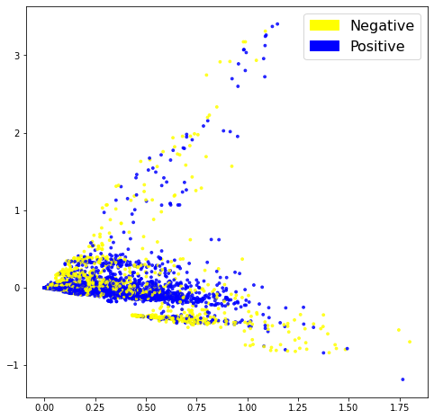
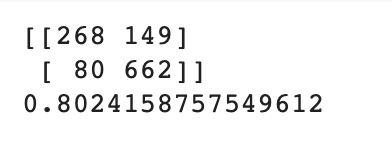
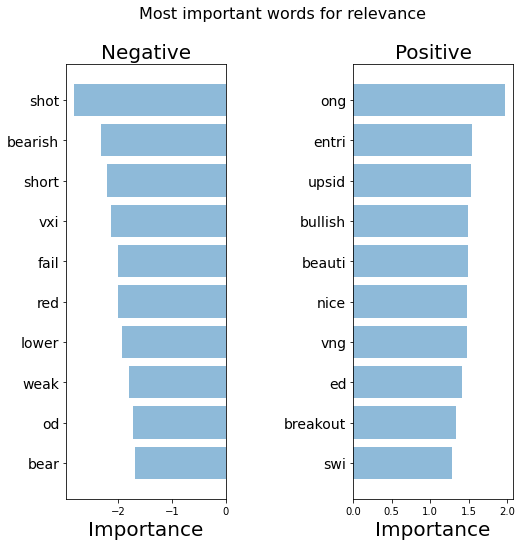
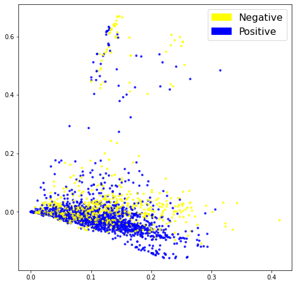
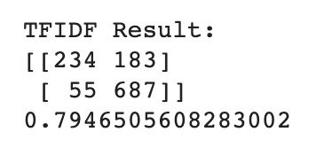
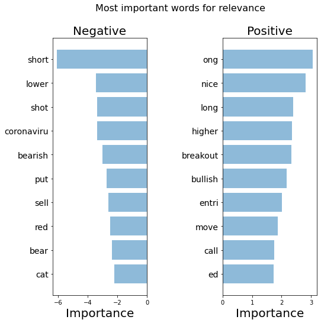
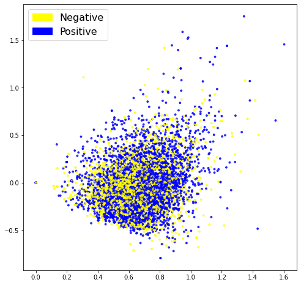
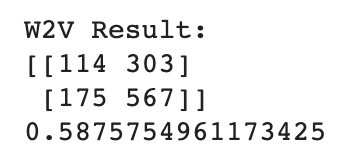
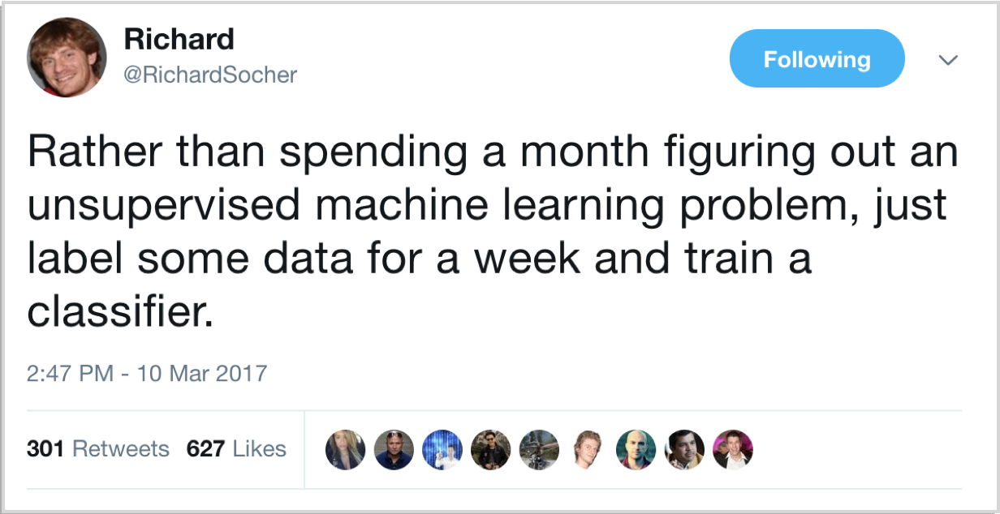

# Stock Market Sentiment Analysis

The [GameStop story](https://www.nbcnews.com/business/business-news/gamestop-reddit-explainer-what-s-happening-stock-market-n1255922) in early 2021 shocked investors, market watchers and regulators alike.  It displayed the power that social media has granted to groups of like-minded people who are able to meet up with relative ease and force their 'will' upon an institution as powerfull as Wall Street by **manipulating the sentiment** about a stock.   

## Stock Market Sentiment
Market sentiment refers to the overall attitude of investors toward a particular security or financial market. It is the feeling or tone of a market, or its crowd psychology, as revealed through the activity and price movement of the securities traded in that market ([Investopedia](https://www.investopedia.com/terms/m/marketsentiment.asp)).  In so many words, rising prices indicate a positive, or bullish sentiment, while failing prices indicate a negative or bearish market sentiment. Understanding market sentiment can help investors make buy or sell decisions.

## This project

Although there are technical indicators, like the VIX / fear index to determine **stock market sentiment**, this project attempts to **determine investor sentiment** by analysing **tweets from investors on Twitter**.

**Natural Language Processing**, or **NLP**, is a branch of artificial intelligence that helps computers understand, interpret and manipulate human language.  It works by converting text/words into numbers and then using these numbers in a classifier / machine learning (ML) / artificial intelligence (AI)  model to make predictions.

In this project, I will use various NLP techniques to analise a **dataset of stock market sentiment tweets** and produce a solution to **predict sentiment** of investors by analysing what they are tweeting about it.  The [stock market sentiment dataset](https://www.kaggle.com/yash612/stockmarket-sentiment-dataset) is kindly provided on the Kaggle website by [Yash Chaudhary](https://www.kaggle.com/yash612).  The dataset contains approximately 6,000 tweets regarding stocks, trading and economic forecasts from twitter.  Each tweet was classified as having a positive(1) or negative(0) sentiment. 

## Project Approach 

Researching best practices for conducting a sentiment analysis, I came across an [exceptionally comprehensive article](https://blog.insightdatascience.com/how-to-solve-90-of-nlp-problems-a-step-by-step-guide-fda605278e4e) on how to solve NLP problems in 'the real world'.  Although I did not follow all the steps, I largely used  [Emmanuel Ameisen](https://medium.com/@EmmanuelAmeisen)'s structure to plan and execute this project.

The high level approach can be summed up as follows:

1.   Clean and prep the data
2.   Start with a quick and simple classifier
3.   Evaluate and explain it's predictions
4.   Use insights gained in step 3, make changes to the classifier / model and repeat the process.  

## Clean and Preprocess the Data

Before we can convert text to numbers, we need to process the input text and make sure that the text we convert makes the most sense to a model.  In order to analise text like tweets or sentences,  we need to first clean it up by removing unnecessary characters that add noise to the data.  It is also good practice to remove stopwords that are common throughout text but does not necessarily add any additional meaning to the text. 

The next step is called **tokenisation** which is the process of taking a string of words and chopping it up in words, or better said '**tokens**'. 

## Bag of Words

Once we have the tokens or words, we need to somehow convert these into numbers whilst maintaining enough information so that the text can be 'understood'.  One very intuitive way to do this is by building a vocabulary of words that are present in our cleaned text, and use that as a basis to work from.

One such approach is the **Bag of Words (BoW)** model which is a representation of a text (sentence / document / tweet) as a list (bag) of all its words, disregarding grammar and word order but keeping count of **how many times** a word is in the input text. 

Once encoded every tweet will be represented as a vector with mostly zero's, but counts for the words in it.  Before we continue, it is good to attempt a visualisation by reducing the dimensions of the data using a technique like PCA (Principal Component Analysis). 

The first look at the data is not too bad.  Although the classes are not perfectly split, we can see at least some seperation between them.  

Next up the data is split into a training- and testing set and these are run through a list of classifiers.  After training the Logistic Regression  model gives an **accuracy score of 80%** which is very good as a first attempt.  

## Inspect the BoW model

Now we use the test data to make predictions using the classifier.  Inspecting the model, we cannot just focus on the correct predictions.  We also need to understand what type of errors our classifiers are making. 

Evaluating the confusion matrix that result from this, we can see that the model's worst quadrant is on False-Positives(13%).  False-Positives are tweets which were meant to be positive, but the classifier picked it up as a negative sentiment.  As this model is used to make investment decisions, it is probably 'safer' to have more False-Positives (13%) as opposed to False-Negatives (only 7%) as this will produce more conservative predictions.  It will ultimately be decided by the end users of the product if a safer or more risky model is preferred.  

Before we move on, it is also good practice to inspect the model to understand which words the model uses to achieve this result.  This figure plots the top ten words for each sentiment, positive and negative.  

Looking at the top 10 words for each category, the classifier picks up, correctly so, that the negative tweets has the words bearish, lower, weak and short.  On the positive side, words like bullish, upsid (upside), nice and beauti (a promising stock) increases our confidence in the classifier.  

We also find a number of abbreviations for specific stocks in our list.  Doing a bit of research on these stock prices at the time that this dataset was created (early 2020), we can see that the stock price for 'red'(no 6), short for Red 5 Limited, dipped between mid-March and end of May 2020.  Oil & Natural Gas Corporation Limited, 'ong' (no 1) stock price, on the other hand, was recovering at about the same period, correctly reflecting the positive sentiment of investors at the time.  

Important to note at this point, however, is that with machine learning we want our model to be better at **generalising** as opposed to **memorising**.  The 'time factor' in this model will make me weary of a model that overfits on specific stock names as opposed to more general terms like bearish and bullish. 

The negative list has 7 general words and 3 stock names while the positive list has 6 general words and 4 stock names.  We will compare this in following versions of the model. 

## Vocabulary

One way to improve the model would be the use of vocabulary structure. We can use **TF-IDF** score (Term Frequency, Inverse Document Frequency) on top of our BoW's model to try and achieve this. 

TF-IDF weighs words by how rare they are in our dataset, discounting words that are too frequent, like a stock price that is currently in the news, adding 'noise' to the data and causing the model to overfit.  Once vectorised, let's inspect the PCA visualisation.

The visualisation above looks very similar in nature to the BoW model, so it does not, at first glance, look as if this approach is having a huge impact. 

Training a logistic regressor on the data confirms this finding with a slightly less accurate score of **79,5%**.  

## Inspecting the TF-IDF Model
 

The confusion matrix for the TF-IDF model yields some noteworthy results.  Inspecting the tweets that the model got wrong, the False-Negatives now account for only 5% while 16% are False-Positives, in other words positive results that are incorrectly predicted as negative. 

The high count in False_Positives makes for an even more conservative model as the previous one. Should the requirement be for a more conservative model, the lower number of False-Negatives (negative tweets incorrectly interpreted as positive) can potentially prevent losses. 

Although the accuracy of the TF-IDF model is slightly lower than the BoW model, the top ten Negative words are already more generalised, with 8 out of 10 words not a specific stock name.  This list also picked up 'coronaviru' which was a constant negative influence in 2020. 

Looking at the positive words, only 2 are stock prices although 'ong', Oil & Natural Gas Corporation Limited, is still at the top.  The more general words like nice, long, higher and bullish have increased from 6 to 8 which should improve the generalisation of our model. 

The TF-IDF model, although 0.5% lower in accuracy, is a better model when interpreted like this. 

## Semantic Meaning

The previous 2 approaches used mainly frequency of words without taking context into account.  Semantics refers not only to the literal meaning of a word, but rather how the meanings of words within a text relate to each other. 

**Word2vec** is a **continuous bag-of-words architecture**, meaning that the model predicts the current word from a window of surrounding context words, thus giving us insight into the semantics or meaning of a tweet.  We will use this model to see if taking semantics into account, we are able to improve the accuracy of our model. 

The PCA visualisation is definitely not an improvement on the previous two approaches.  This can be an indicator that this approach is not successfull or it can simply be a result of our dimension reduction. 

In order to see if the Word2Vec embeddings are of any use to us, let's train a classifier on them.

For the Word2Vec embeddings, the Support Vector Classifier comes out as the best approach.  The accuracy of the model, however, is only **75%**, which is considerably lower than the previous two classifiers.  

## Inspect the Word2Vec Model

When we run the classifier on the test data, we get an accuracy score of only **59%** with an uneven confusion matrix.  We will not explore the Word2vec option further.  

## BERT Pipeline

At this point, it seems that our dataset is performing better on simpler models, with results declining as the complexity of the model increases.  Just to confirm this, however, let's also use the Sentiment Analysis Pipeline from the **BERT model**.  This model generates embeddings that allow us to have multiple vector representations for the same word, based on the context in which the word is used, whereas Word2Vec only has one vector representation for each word.  

Fitting our test data on the BERT Sentiment Analysis pipeline, however, yields an accuracy score of **46%**, so for now I will abandon both the **Word2Vec** and **BERT** as possible solutions to our problem. 

## Machine Learning

Having experimented with compact sentence embeddings in the previous two attempts, it might be worth it to look at a solution that takes in whole sentences as input and so also utilising the **syntactic information** of our tweets.  

More complex models like Long Short Term Memory (LSTM) networks and Convolutional Neural Networks (CNN) keeps the order of words in a sentence by treating the sentence as a series of vectors.

## LSTM Model

Long Short Term Memory networks are the classic model used to train text. Given that the results tended to indicate that a simpler model will yield better results, we will not build a very complex model, traning only 280k parameters.  

When fitted, the model gives a 79% accuracy but when test data is run on it, leaves us with an accuracy score of only **64%**.  This is classic overfitting on the training data which can be a result of specific stock names trending at the time of capturing the data, adding too much noise, as we saw in the first model.   

## CNN Model

It might be worth exploring something a little simpler than a LSTM, which is where the Convolutional Neural Networks (CNN) makes it's entrance.  

Famous for it's ability to perform  image classification, CNN's have also proved their effectiveness in text classification. It is an easier and simpler model to train while preserving the syntactic order of words in a tweet. 

When fitted on the training data, the model yields an accuracy of 93% after only 3 epochs, but even this model is plagued by the issue of **overfitting on the training data**, yielding only **72% accuracy** when fitted on the testing set.  

## Conclusion

After having performed all of these approaches on the stock sentiment dataset the **simple Logistic Regression classifier** produced the best results.  

I was reminded of this tweet by Richard Socher that I came across when I started to research this project:

As the saying goes, (sometimes) less is more!

[**Back to Portfolio**](https://africanleo.github.io/Leonora-Schreurs-Portfolio/)
